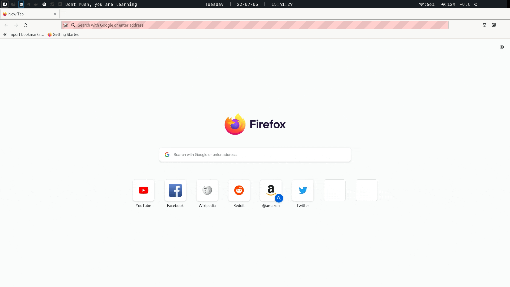

# Task Enforcer :ledger: :lock:

| Table Of Contents       | link       |
| ----------------------- | ---------- |
| About 🔍                 | [here](#1) |
| Dev roadmap :golf:      | [here](#2) |
| Running and Debuging 🛠️  | [here](#3) |

## About 🔍 
This extension helps its users to better manage their schedule by notifying and enforcing task deadlines.
After the deadline, users cannot access social media or other websites before completing the task

## Development roadmap :golf: 
### Firefox

- [x] Implement website blocking / redirect
- [x] Block based on condition
  - [x] Save blockList config using Storage
- [x] Create Settings page
  - [x] create editable TaskList Table
  - [x] Sort tasks by time and current time
  - [x] create editable BlockList table
  - [x] Store config using Storage API
- [x] Create task notification
- [x] Create interactive Popup
- [x] make it pretty? (imposible T_T)
- [ ] Complete Readme
- [ ] Fix bugs && prepare for Store

### Chrome
- [ ] Copy firefox extension
- [ ] Translate manifest v2 -> v3
  - [ ] Convert background scripts to non-persistent

## Running and Debuging 🛠️ 

### <ins> To run and debug Firefox extension: </ins>

- install web-ext tool `npm install --global web-ext`
- Move into firefox root directory `cd firefox`
- To test extension run `web-ext run`

### <ins> To inspect extension </ins>

- go to `about:debugging` ➞ `This Firefox` ➞ `taskEnforcer` ➞ `Inspect`
